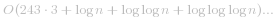
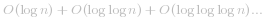
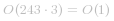
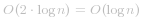
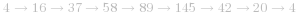

### 📺视频题解  
 [202. 快乐数 - Lizzi.mp4](9d8ce931-e835-45d1-a3d2-ab54b52b5377)

### 📖文字题解
#### 方法一：用 HashSet 检测循环

我们可以先举几个例子。我们从 *7* 开始。则下一个数字是 *49*（因为 *7^2=49*），然后下一个数字是 *97*（因为 *4^2+9^2=97*）。我们可以不断重复该的过程，直到我们得到 *1*。因为我们得到了 *1*，我们知道 *7* 是一个快乐数，函数应该返回 `true`。

 [fig1](https://assets.leetcode-cn.com/solution-static/202/202_fig1.png)

再举一个例子，让我们从 *116* 开始。通过反复通过平方和计算下一个数字，我们最终得到 *58*，再继续计算之后，我们又回到 *58*。由于我们回到了一个已经计算过的数字，可以知道有一个循环，因此不可能达到 *1*。所以对于 *116*，函数应该返回 `false`。

 [fig2](https://assets.leetcode-cn.com/solution-static/202/202_fig2.png)

根据我们的探索，我们猜测会有以下三种可能。
1. 最终会得到 *1*。
2. 最终会进入循环。
3. 值会越来越大，最后接近无穷大。

第三个情况比较难以检测和处理。我们怎么知道它会继续变大，而不是最终得到 *1* 呢？我们可以仔细想一想，每一位数的最大数字的下一位数是多少。

| Digits        | Largest       | Next  |
| ------------- |:-------------:| -----:|
| 1             | 9             | 81    |
| 2             | 99            | 162   |
| 3             | 999           | 243   |
| 4             | 9999          | 324   |
| 13            | 9999999999999 | 1053  |

对于 *3* 位数的数字，它不可能大于 *243*。这意味着它要么被困在 *243* 以下的循环内，要么跌到 *1*。*4* 位或 *4* 位以上的数字在每一步都会丢失一位，直到降到 *3* 位为止。所以我们知道，最坏的情况下，算法可能会在 *243* 以下的所有数字上循环，然后回到它已经到过的一个循环或者回到 *1*。但它不会无限期地进行下去，所以我们排除第三种选择。

即使在代码中你不需要处理第三种情况，你仍然需要理解为什么它永远不会发生，这样你就可以证明为什么你不处理它。

**算法：**

算法分为两部分，我们需要设计和编写代码。

1. 给一个数字 *n*，它的下一个数字是什么？
2. 按照一系列的数字来判断我们是否进入了一个循环。

第 1 部分我们按照题目的要求做数位分离，求平方和。

第 2 部分可以使用 HashSet 完成。每次生成链中的下一个数字时，我们都会检查它是否已经在 HashSet 中。
- 如果它不在 HashSet 中，我们应该添加它。
- 如果它在 HashSet 中，这意味着我们处于一个循环中，因此应该返回 `false`。

我们使用 HashSet  而不是向量、列表或数组的原因是因为我们反复检查其中是否存在某数字。检查数字是否在哈希集中需要 *O(1)* 的时间，而对于其他数据结构，则需要 *O(n)* 的时间。选择正确的数据结构是解决这些问题的关键部分。

```python [solution1-Python]
def isHappy(self, n: int) -> bool:

    def get_next(n):
        total_sum = 0
        while n > 0:
            n, digit = divmod(n, 10)
            total_sum += digit ** 2
        return total_sum

    seen = set()
    while n != 1 and n not in seen:
        seen.add(n)
        n = get_next(n)

    return n == 1
```

```java [solution1-Java]
class Solution {

    private int getNext(int n) {
        int totalSum = 0;
        while (n > 0) {
            int d = n % 10;
            n = n / 10;
            totalSum += d * d;
        }
        return totalSum;
    }

    public boolean isHappy(int n) {
        Set<Integer> seen = new HashSet<>();
        while (n != 1 && !seen.contains(n)) {
            seen.add(n);
            n = getNext(n);
        }
        return n == 1;
    }
}
```

```csharp [solution1-C#]
class Solution {
    private int getNext(int n) {
        int totalSum = 0;
        while (n > 0) {
            int d = n % 10;
            n = n / 10;
            totalSum += d * d;
        }
        return totalSum;
    }

    public bool IsHappy(int n) {
        HashSet <int> seen = new HashSet<int>();
        while (n != 1 && !seen.Contains(n)) {
            seen.Add(n);
            n = getNext(n);
        }
        return n == 1;
    }
}
```

```golang [solution1-Golang]
func isHappy(n int) bool {
    m := map[int]bool{}
    for ; n != 1 && !m[n]; n, m[n] = step(n), true { }
    return n == 1
}

func step(n int) int {
    sum := 0
    for n > 0 {
        sum += (n%10) * (n%10)
        n = n/10
    }
    return sum
}
```

**复杂度分析**

确定这个问题的时间复杂度对于一个 “简单” 级别的问题来说是一个挑战。如果您对这些问题还不熟悉，可以尝试只计算  `getNext(n)` 函数的时间复杂度。

* 时间复杂度：  =  。
	*  查找给定数字的下一个值的成本为  ，因为我们正在处理数字中的每位数字，而数字中的位数由   给定。
	* 要计算出总的时间复杂度，我们需要仔细考虑循环中有多少个数字，它们有多大。
	- 我们在上面确定，一旦一个数字低于 *243*，它就不可能回到 *243* 以上。因此，我们就可以用 *243* 以下最长循环的长度来代替 *243*，不过，因为常数无论如何都无关紧要，所以我们不会担心它。
	- 对于高于 *243* 的 *n*，我们需要考虑循环中每个数高于 *243* 的成本。通过数学运算，我们可以证明在最坏的情况下，这些成本将是  。幸运的是，  是占主导地位的部分，而其他部分相比之下都很小（总的来说，它们的总和小于 ），所以我们可以忽略它们。
* 空间复杂度： 。与时间复杂度密切相关的是衡量我们放入 HashSet 中的数字以及它们有多大的指标。对于足够大的 *n*，大部分空间将由 *n* 本身占用。我们可以很容易地优化到  ，方法是只保存集合中小于 *243* 的数字，因为对于较高的数字，无论如何都不可能返回到它们。

####  方法二：快慢指针法
通过反复调用 `getNext(n)` 得到的链是一个隐式的链表。隐式意味着我们没有实际的链表节点和指针，但数据仍然形成链表结构。起始数字是链表的头 “节点”，链中的所有其他数字都是节点。`next` 指针是通过调用 `getNext(n)` 函数获得。

意识到我们实际有个链表，那么这个问题就可以转换为检测一个链表是否有环。因此我们在这里可以使用弗洛伊德循环查找算法。这个算法是两个奔跑选手，一个跑的快，一个跑得慢。在龟兔赛跑的寓言中，跑的快的称为 “乌龟”，跑得快的称为 “兔子”。

不管乌龟和兔子在循环中从哪里开始，它们最终都会相遇。这是因为兔子每走一步就向乌龟靠近一个节点（在它们的移动方向上）。

  [fig1](https://assets.leetcode-cn.com/solution-static/202/1.jpg)  [fig2](https://assets.leetcode-cn.com/solution-static/202/2.jpg)  [fig3](https://assets.leetcode-cn.com/solution-static/202/3.jpg)  [fig4](https://assets.leetcode-cn.com/solution-static/202/4.jpg)  [fig5](https://assets.leetcode-cn.com/solution-static/202/5.jpg)  [fig6](https://assets.leetcode-cn.com/solution-static/202/6.jpg)  [fig7](https://assets.leetcode-cn.com/solution-static/202/7.jpg)  [fig8](https://assets.leetcode-cn.com/solution-static/202/8.jpg) 

**算法：**

我们不是只跟踪链表中的一个值，而是跟踪两个值，称为快跑者和慢跑者。在算法的每一步中，慢速在链表中前进 1 个节点，快跑者前进 2 个节点（对 `getNext(n)` 函数的嵌套调用）。

如果 `n` 是一个快乐数，即没有循环，那么快跑者最终会比慢跑者先到达数字 1。

如果 `n` 不是一个快乐的数字，那么最终快跑者和慢跑者将在同一个数字上相遇。

```python [solution2-Python]
def isHappy(self, n: int) -> bool:  
    def get_next(number):
        total_sum = 0
        while number > 0:
            number, digit = divmod(number, 10)
            total_sum += digit ** 2
        return total_sum

    slow_runner = n
    fast_runner = get_next(n)
    while fast_runner != 1 and slow_runner != fast_runner:
        slow_runner = get_next(slow_runner)
        fast_runner = get_next(get_next(fast_runner))
    return fast_runner == 1
```

```java [solution2-Java]
class Solution {

     public int getNext(int n) {
        int totalSum = 0;
        while (n > 0) {
            int d = n % 10;
            n = n / 10;
            totalSum += d * d;
        }
        return totalSum;
    }

    public boolean isHappy(int n) {
        int slowRunner = n;
        int fastRunner = getNext(n);
        while (fastRunner != 1 && slowRunner != fastRunner) {
            slowRunner = getNext(slowRunner);
            fastRunner = getNext(getNext(fastRunner));
        }
        return fastRunner == 1;
    }
}
```

```csharp [solution2-C#]
class Solution {
    public int getNext(int n) {
        int totalSum = 0;
        while (n > 0) {
            int d = n % 10;
            n = n / 10;
            totalSum += d * d;
        }
        return totalSum;
    }

    public bool IsHappy(int n) {
        int slowRunner = n;
        int fastRunner = getNext(n);
        while (fastRunner != 1 && slowRunner != fastRunner) {
            slowRunner = getNext(slowRunner);
            fastRunner = getNext(getNext(fastRunner));
        }
        return fastRunner == 1;
    }
}
```

```golang [solution2-Golang]
func isHappy(n int) bool {
    slow, fast := n, step(n)
    for fast != 1 && slow != fast {
        slow = step(slow)
        fast = step(step(fast))
    }
    return fast == 1
}

func step(n int) int {
    sum := 0
    for n > 0 {
        sum += (n%10) * (n%10)
        n = n/10
    }
    return sum
}
```

**复杂度分析**

* 时间复杂度： 。该分析建立在对前一种方法的分析的基础上，但是这次我们需要跟踪两个指针而不是一个指针来分析，以及在它们相遇前需要绕着这个循环走多少次。
	* 如果没有循环，那么快跑者将先到达 1，慢跑者将到达链表中的一半。我们知道最坏的情况下，成本是	 。
	* 一旦两个指针都在循环中，在每个循环中，快跑者将离慢跑者更近一步。一旦快跑者落后慢跑者一步，他们就会在下一步相遇。假设循环中有 *k* 个数字。如果他们的起点是相隔 *k-1* 的位置（这是他们可以开始的最远的距离），那么快跑者需要 *k-1* 步才能到达慢跑者，这对于我们的目的来说也是不变的。因此，主操作仍然在计算起始 n 的下一个值，即  。
* 空间复杂度：*O(1)*，对于这种方法，我们不需要哈希集来检测循环。指针需要常数的额外空间。


####  方法三：数学
前两种方法是你在面试中应该想到的。第三种方法不是你在面试中会写的，而是针对对数学好奇的人，因为它很有趣。

下一个值可能比自己大的最大数字是什么？根据我们之前的分析，我们知道它必须低于 243。因此，我们知道任何循环都必须包含小于 243 的数字，用这么小的数字，编写一个能找到所有周期的强力程序并不困难。

如果这样做，您会发现只有一个循环： 。所有其他数字都在进入这个循环的链上，或者在进入 *1* 的链上。

因此，我们可以硬编码一个包含这些数字的散列集，如果我们达到其中一个数字，那么我们就知道在循环中。

**算法：**

```python [solution3-Python]
def isHappy(self, n: int) -> bool:

    cycle_members = {4, 16, 37, 58, 89, 145, 42, 20}

    def get_next(number):
        total_sum = 0
        while number > 0:
            number, digit = divmod(number, 10)
            total_sum += digit ** 2
        return total_sum

    while n != 1 and n not in cycle_members:
        n = get_next(n)

    return n == 1
```

```java [solution3-Java]
class Solution {

    private static Set<Integer> cycleMembers =
        new HashSet<>(Arrays.asList(4, 16, 37, 58, 89, 145, 42, 20));

    public int getNext(int n) {
        int totalSum = 0;
        while (n > 0) {
            int d = n % 10;
            n = n / 10;
            totalSum += d * d;
        }
        return totalSum;
    }


    public boolean isHappy(int n) {
        while (n != 1 && !cycleMembers.contains(n)) {
            n = getNext(n);
        }
        return n == 1;
    }
}
```

```csharp [solution3-C#]
class Solution {
    public int getNext(int n) {
        int totalSum = 0;
        while (n > 0) {
            int d = n % 10;
            n = n / 10;
            totalSum += d * d;
        }
        return totalSum;
    }

    public bool IsHappy(int n) {
        HashSet<int> cycleMembers =
            new HashSet<int>(new int[8] {4, 16, 37, 58, 89, 145, 42, 20});

        while (n != 1 && !cycleMembers.Contains(n)) {
            n = getNext(n);
        }
        return n == 1;
    }
}
```

```golang [solution3-Golang]
func isHappy(n int) bool {
    cycle := map[int]bool{4: true, 6: true, 37: true, 58: true, 89: true, 145: true, 42: true, 20: true}
    for n != 1 && !cycle[n] {
        n = step(n)
    }
    return n == 1
}

func step(n int) int {
    sum := 0
    for n > 0 {
        sum += (n%10) * (n%10)
        n = n/10
    }
    return sum
}
```

**复杂度分析**

* 时间复杂度： 。和上面一样。
* 空间复杂度：*O(1)*，我们没有保留我们所遇到的数字的历史记录。硬编码哈希集的大小是固定的。