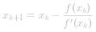
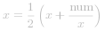

####  概述：
平方根相关问题通常可以在对数时间内求解。这里列出了从最坏到最好的三种标准对数时间的方法：
- 递归
- 二分查找
- 牛顿迭代法

后面两个算法是最有趣的，让我们详细的讨论它。

这些解决方法都有相同的起点。`num` 是一个有效的完全平方数若  。

####  方法一：二分查找
- 若 `num < 2`，返回 `true`。
- 设置左边界为 `2`，右边界为 `num/2`。
- 当 `left <= right`：
	-  令 `x = (left + right) / 2` 作为一个猜测，计算 `guess_squared = x * x` 与 `num` 做比较：
		- 如果 `guess_squared == num`，则 `num` 是一个完全平方数，返回 `true`。
		- 如果 `guess_squared > num` ，设置右边界 `right = x-1`。
		- 否则设置左边界为 `left = x+1`。
- 如果在循环体内没有找到，则说明 `num` 不是完全平方数，返回 `false`。

 [在这里插入图片描述](https://imgconvert.csdnimg.cn/aHR0cHM6Ly9waWMubGVldGNvZGUtY24uY29tL0ZpZ3VyZXMvMzY3L2JpbmFyeS5wbmc?x-oss-process=image/format,png)

**算法：**

```python [solution1-Python]
class Solution:
    def isPerfectSquare(self, num: int) -> bool:
        if num < 2:
            return True
        
        left, right = 2, num // 2
        
        while left <= right:
            x = left + (right - left) // 2
            guess_squared = x * x
            if guess_squared == num:
                return True
            if guess_squared > num:
                right = x - 1
            else:
                left = x + 1
        
        return False
```

```java [solution1-Java]
class Solution {
  public boolean isPerfectSquare(int num) {
    if (num < 2) {
      return true;
    }

    long left = 2, right = num / 2, x, guessSquared;
    while (left <= right) {
      x = left + (right - left) / 2;
      guessSquared = x * x;
      if (guessSquared == num) {
        return true;
      }
      if (guessSquared > num) {
        right = x - 1;
      } else {
        left = x + 1;
      }
    }
    return false;
  }
}
```

**复杂度分析**
* 时间复杂度： 。
* 空间复杂度： 。


####  方法二：牛顿迭代法
牛顿迭代法：公式是如何推导的呢？让我们做一个非常粗略的推导。

问题是找出：  的根。

牛顿迭代法的思想是从一个初始近似值开始，然后作一系列改进的逼近根的过程。
 [在这里插入图片描述](https://imgconvert.csdnimg.cn/aHR0cHM6Ly9waWMubGVldGNvZGUtY24uY29tL0ZpZ3VyZXMvMzY3L3BhcmFib2xhNC5wbmc?x-oss-process=image/format,png)
举个例子：我们取 *x_k* 作为根的初始近似值，然后在 *(x_k，f(x_k))* 处做切线与 *x* 轴相交经过 *x_{k+1}*。

通过斜率可写等价公式  

转换后得  

将以下公式代入
-  
- *f'(x_k) = 2x_k*

得到  

**算法：**
- 我们取 `num/2` 作为初始近似值。
- 当 `x * x > num`，用牛顿迭代法取计算下一个近似值： 。
- 返回 `x*x == num`。
 [在这里插入图片描述](https://imgconvert.csdnimg.cn/aHR0cHM6Ly9waWMubGVldGNvZGUtY24uY29tL0ZpZ3VyZXMvMzY3L25ld3RvbjIucG5n?x-oss-process=image/format,png)
```python [solution2-Python]
class Solution:
    def isPerfectSquare(self, num: int) -> bool:
        if num < 2:
            return True
        
        x = num // 2
        while x * x > num:
            x = (x + num // x) // 2
        return x * x == num
```

```java [solution2-Java]
class Solution {
  public boolean isPerfectSquare(int num) {
    if (num < 2) return true;

    long x = num / 2;
    while (x * x > num) {
      x = (x + num / x) / 2;
    }
    return (x * x == num);
  }
}
```

**复杂度分析**

* 时间复杂度： 。
* 空间复杂度： 。